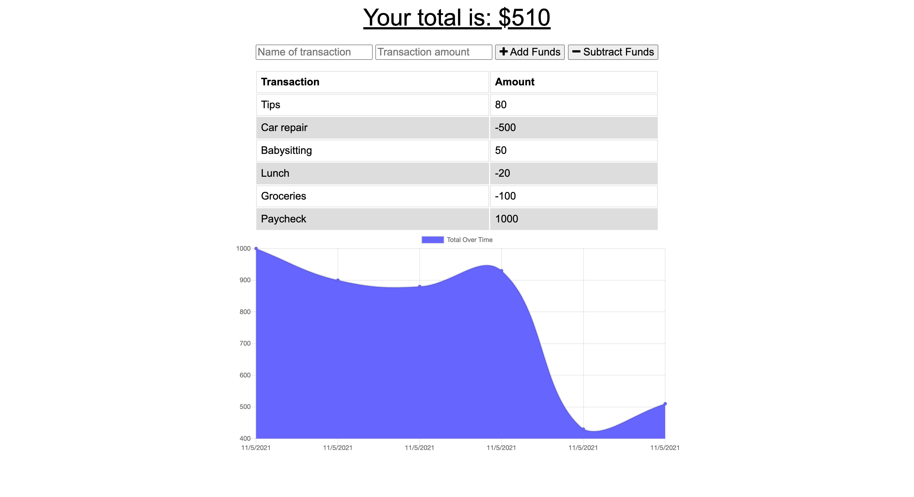

# offline-budget-tracker

## Description

This is a full-stack application that keeps track of a user's budget and various transactions made over time. This is also a progressive web app (PWA) that can be used without an Internet connection.



## Table of Contents

- [Installation](#installation)
- [Usage](#usage)
- [Credits](#credits)
- [License](#license)
- [Links](#links)
- [Questions](#questions)

## Installation

Use the following command to install dependencies:

```
$ npm i
```

MongoDB must be installed in order to use this app locally. Once the Mongo server is running, use the following command to initialize the app:

```
$ node server.js
```

## Usage

When used in the browser, a user is first brought to the homepage where they can start logging their transactions. Both the name of the transaction and the amount must be filled in, and the user can either select "Add Funds" or "Subtract Funds" to represent money received or spent. Once submitted, the total budget amount at the top of the page updates and is represented on the graph.

## Credits

N/A

## License

This project is licensed under the MIT license.

## Links

This application is deployed to Heroku and can be viewed [here](https://hidden-badlands-92774.herokuapp.com/).

## Questions

If you have any questions about this repository, contact me directly at liaobrien123@gmail.com. You can find more of my work at [liaobrien](https://github.com/liaobrien).
